# Практика 4. Прикладной уровень

## Программирование сокетов: Прокси-сервер
Разработайте прокси-сервер для проксирования веб-страниц.
Приложите скрины, демонстрирующие работу прокси-сервера.

### Запуск прокси-сервера
Запустите свой прокси-сервер из командной строки, а затем запросите веб-страницу с помощью
вашего браузера. Направьте запросы на прокси-сервер, используя свой IP-адрес и номер порта.
Например, http://localhost:8888/www.google.com

_(*) Вы должны заменить стоящий здесь 8888 на номер порта в серверном коде,
то есть тот, на котором прокси-сервер слушает запросы._

Вы можете также настроить непосредственно веб-браузер на использование вашего прокси сервера.
В настройках браузера вам нужно будет указать адрес прокси-сервера и номер порта,
который вы использовали при запуске прокси-сервера (опционально).

### А. Прокси-сервер без кеширования (4 балла)
1. Разработайте свой прокси-сервер для проксирования http GET запросов от клиента веб-серверу
   с журналированием проксируемых HTTP-запросов. В файле журнала сохраняется
   краткая информация о проксируемых запросах (URL и код ответа). Кеширование в этом
   задании не требуется. **(2 балла)**
2. Добавьте в ваш прокси-сервер обработку ошибок. Отсутствие обработчика ошибок может
   вызвать проблемы. Особенно, когда клиент запрашивает объект, который не доступен, так
   как ответ 404 Not Found, как правило, не имеет тела, а прокси-сервер предполагает, что
   тело есть и пытается прочитать его. **(1 балл)**
3. Простой прокси-сервер поддерживает только метод GET протокола HTTP. Добавьте
   поддержку метода POST. В запросах теперь будет использоваться также тело запроса
   (body). Для вызова POST запросов вы можете использовать Postman. **(1 балл)**

Приложите скрины или логи работы сервера.

#### Демонстрация работы
todo

### Б. Прокси-сервер с кешированием (4 балла)
Когда прокси-сервер получает запрос, он проверяет, есть ли запрашиваемый объект в кэше, и,
если да, то возвращает объект из кэша без соединения с веб-сервером. Если объекта в кэше нет,
прокси-сервер извлекает его с веб-сервера обычным GET запросом, возвращает клиенту и
кэширует копию для будущих запросов.

Для проверки того, прокис объект в кеше или нет, необходимо использовать условный GET
запрос. В таком случае вам необходимо указывать в заголовке запроса значение для If-Modified-Since и If-None-Match.
Подробности можно найти [тут](https://ruturajv.wordpress.com/2005/12/27/conditional-get-request).

Будем считать, что кеш-память прокси-сервера хранится на его жестком диске. Ваш прокси-сервер
должен уметь записывать ответы в кеш и извлекать данные из кеша (т.е. с диска) в случае
попадания в кэш при запросе. Для этого необходимо реализовать некоторую внутреннюю
структуру данных, чтобы отслеживать, какие объекты закешированы.

Приложите скрины или логи, из которых понятно, что ответ на повторный запрос был взят из кэша.

#### Демонстрация работы
todo

### В. Черный список (2 балла)
Прокси-сервер отслеживает страницы и не пускает на те, которые попадают в черный список. Вместо
этого прокси-сервер отправляет предупреждение, что страница заблокирована. Список доменов
и/или URL-адресов для блокировки по черному списку задается в **конфигурационном файле**.

Приложите скрины или логи запроса из черного списка.

#### Демонстрация работы
todo

## Wireshark. Работа с DNS
Для каждого задания в этой секции приложите скрин с подтверждением ваших ответов.

### А. Утилита nslookup (1 балл)

#### Вопросы
1. Выполните nslookup, чтобы получить IP-адрес какого-либо веб-сервера в Азии
   - IP-адрес `nginx.com` - это `159.60.134.0`
2. Выполните nslookup, чтобы определить авторитетные DNS-серверы для какого-либо университета в Европе
   - Авторитетные DNS-сервера для `www.uga.edu` - это
      + `ns-1875.awsdns-42.co.uk`
      + `ns-854.awsdns-42.net`
      + `ns-454.awsdns-56.com`
      + `ns-1120.awsdns-12.org`
3. Используя nslookup, найдите веб-сервер, имеющий несколько IP-адресов. Сколько IP-адресов имеет веб-сервер вашего учебного заведения?
   - Подойдет `vk.com`: его адреса - это `87.240.129.133`, `93.186.225.194`, `87.240.137.164`, `87.240.132.78`, `87.240.132.67` и `87.240.132.72`
   - У сервера нашего доблестного вуза один IP-адрес - `85.193.83.151`

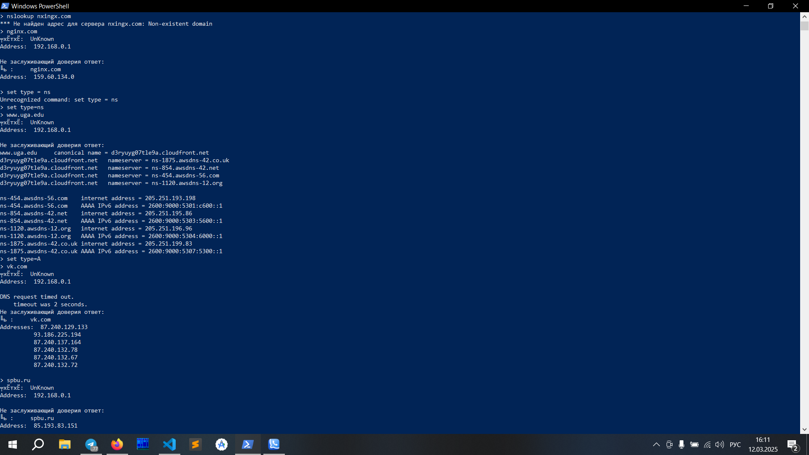

### Б. DNS-трассировка www.ietf.org (3 балла)

#### Подготовка
1. Используйте ipconfig для очистки кэша DNS на вашем компьютере.
2. Откройте браузер и очистите его кэш (для Chrome можете использовать сочетание клавиш
   CTRL+Shift+Del).
3. Запустите Wireshark и введите `ip.addr == ваш_IP_адрес` в строке фильтра, где значение
   ваш_IP_адрес вы можете получить, используя утилиту ipconfig. Данный фильтр позволит
   нам отбросить все пакеты, не относящиеся к вашему хосту. Запустите процесс захвата пакетов в Wireshark.
4. Зайдите на страницу www.ietf.org в браузере.
5. Остановите захват пакетов.

#### Вопросы
1. Найдите DNS-запрос и ответ на него. С использованием какого транспортного протокола
   они отправлены?
   - Запрос и ответ отправлены с помощью протокола DNS
2. Какой порт назначения у запроса DNS?
   - 53
3. На какой IP-адрес отправлен DNS-запрос? Используйте ipconfig для определения IP-адреса
   вашего локального DNS-сервера. Одинаковы ли эти два адреса?
   - `192.168.0.1`
   - Да, это адрес моего локального DNS-сервера
4. Проанализируйте сообщение-запрос DNS. Запись какого типа запрашивается? Содержатся
   ли в запросе какие-нибудь «ответы»?
   - Идет запрос записи типа `A`
   - В сообщении также указывается шестнадцатиричный идентификатор. Также в подробной информации о пакете указано, что в запросе есть один вопрос и ни одного ответа.
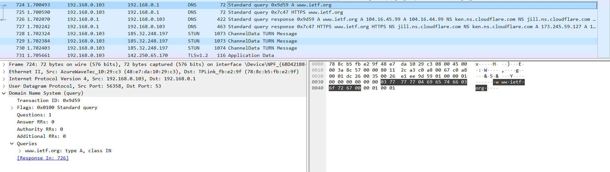
5. Проанализируйте ответное сообщение DNS. Сколько в нем «ответов»? Что содержится в
   каждом?
   - В нем 2 <<ответа>>
   - В каждом из них указывается адрес запрашиваемого сайта, тип записи, ее класс и IP-адрес сайта
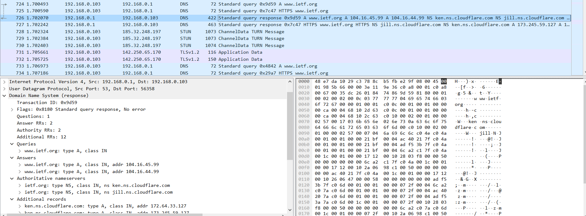
6. Посмотрите на последующий TCP-пакет с флагом SYN, отправленный вашим компьютером.
   Соответствует ли IP-адрес назначения пакета с SYN одному из адресов, приведенных в
   ответном сообщении DNS?
   - Я не вижу TCP-пакета, зато вижу общение с с установкой соединения по протоколу QUIC с сервером, IP-адрес которого был в предыдущем ответе (`104.16.45.99`). В целом в захвате я не увидел TCP-пакетов с флагом SYN, отправленных на этот адрес.
   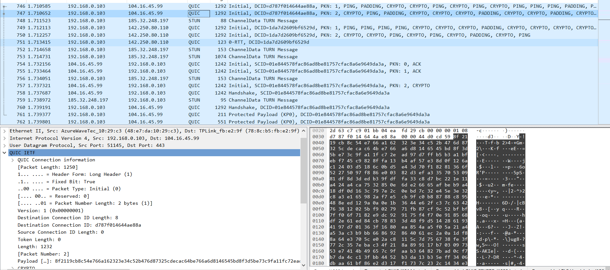
7. Веб-страница содержит изображения. Выполняет ли хост новые запросы DNS перед
   загрузкой этих изображений?
   - Да, еще несколько раз выолняются запросы DNS перед загрузкой изображений:
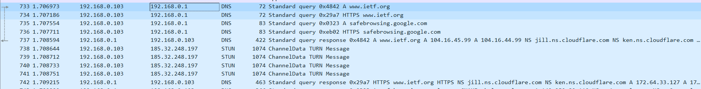

### В. DNS-трассировка www.spbu.ru (2 балла)

#### Подготовка
1. Запустите захват пакетов с тем же фильтром `ip.addr == ваш_IP_адрес`
2. Выполните команду nslookup для сервера www.spbu.ru
3. Остановите захват
4. Вы увидите несколько пар запрос-ответ DNS. Найдите последнюю пару, все вопросы будут относиться к ней

#### Вопросы
1. Каков порт назначения в запросе DNS? Какой порт источника в DNS-ответе?
   - 53
   - 63084
2. На какой IP-адрес отправлен DNS-запрос? Совпадает ли он с адресом локального DNS-сервера, установленного по умолчанию?
   - `192.168.0.1`
   - Да, совпадает
3. Проанализируйте сообщение-запрос DNS. Запись какого типа запрашивается? Содержатся
   ли в запросе какие-нибудь «ответы»?
   - Запрашивается запись типа AAAA
   - Нет, никаких ответов нет
4. Проанализируйте ответное сообщение DNS. Сколько в нем «ответов»? Что содержится в каждом?
   - В нем один <<ответ>>
   - В нем содержится имя сайта, тип записи в базе данных и класс (чего - не слишком понял, везде, где встречал был IN)

### Г. DNS-трассировка nslookup –type=NS (1 балл)
Повторите все шаги по предварительной подготовке из Задания B, но теперь для команды `nslookup –type=NS spbu.ru`

#### Вопросы
1. На какой IP-адрес отправлен DNS-запрос? Совпадает ли он с адресом локального DNS-сервера, установленного по умолчанию?
   - `192.168.0.1`
   - Да, совпадает
2. Проанализируйте сообщение-запрос DNS. Запись какого типа запрашивается? Содержатся ли в запросе какие-нибудь «ответы»?
   - Запрашивается запись типа `NS`
   - Нет, ответов нет
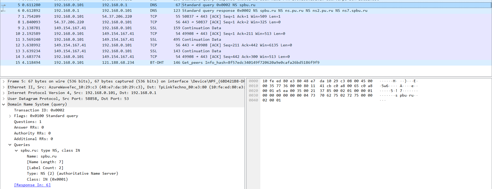
3. Проанализируйте ответное сообщение DNS. Имена каких DNS-серверов университета в
   нем содержатся? А есть ли их адреса в этом ответе?
   - В нем содержатся имена авторитетных dns-серверов
   - Нет, их адресов нет, только имена
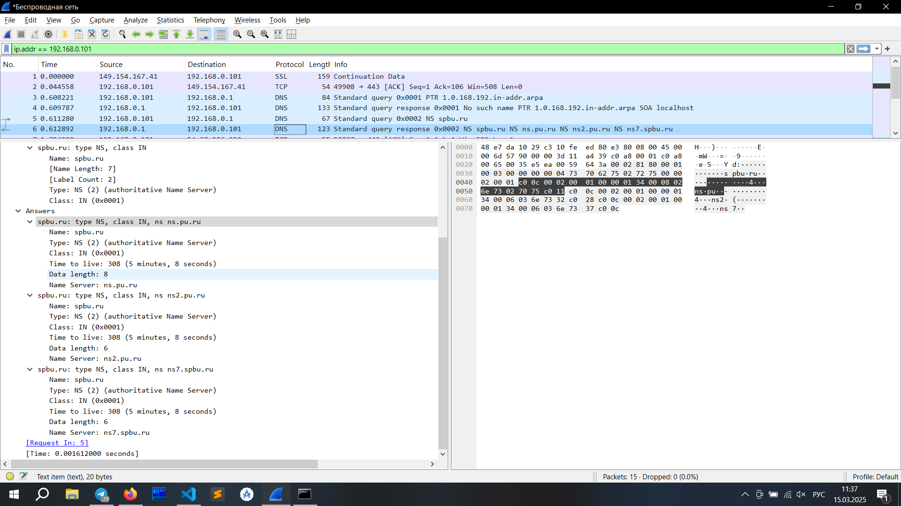

### Д. DNS-трассировка nslookup www.spbu.ru ns2.pu.ru (1 балл)
Снова повторите все шаги по предварительной подготовке из Задания B, но теперь для команды `nslookup www.spbu.ru ns2.pu.ru`.
Запись `nslookup host_name dns_server` означает, что запрос на разрешение доменного имени `host_name` пойдёт к `dns_server`.
Если параметр `dns_server` не задан, то запрос идёт к DNS-серверу по умолчанию (например, к локальному).

#### Вопросы
1. На какой IP-адрес отправлен DNS-запрос? Совпадает ли он с адресом локального DNS-сервера, установленного по умолчанию? Если нет, то какому хосту он принадлежит?
   - `195.70.196.210`
   - Нет, не совпадает. Это IP хоста `ns2.pu.ru`
2. Проанализируйте сообщение-запрос DNS. Запись какого типа запрашивается? Содержатся
   ли в запросе какие-нибудь «ответы»?
   - Запрашивается запись типа `AAAA`
   - Нет, <<ответов>> в ней нет
   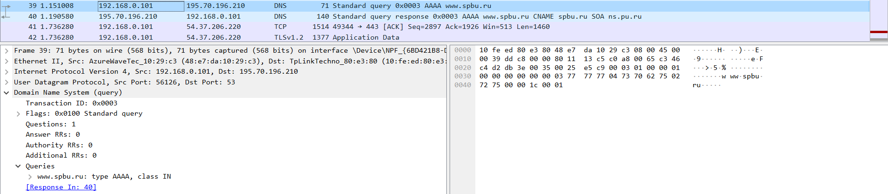
3. Проанализируйте ответное сообщение DNS. Сколько в нем «ответов»? Что содержится в
   каждом?
   - Ответ всего один
   - В нем содержится запись типа `CNAME` про сервер с имененем `www.spbu.ru` из DNS
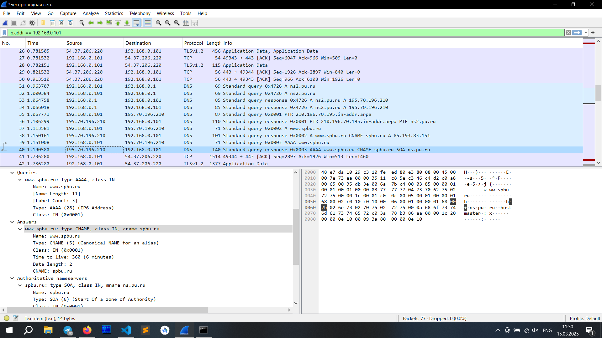

### Е. Сервисы whois (2 балла)
1. Что такое база данных whois?
   - База данных whoisхранит информацию о зарегистрированных доменных именах и IP-адресах
2. Используя различные сервисы whois в Интернете, получите имена любых двух DNS-серверов.
   Какие сервисы вы при этом использовали?
   - DNS-серверы для `github.com` - это DNS[1-4].P08.NSONE.NET, DNS2.P08.NSONE.NE,
   NS-1283.AWSDNS-32.ORG, NS-1707.AWSDNS-21.CO.UK, NS-421.AWSDNS-52.COM. Ответ получен при помощи `whois.domaintols.com`
NS-520.AWSDNS-01.NET
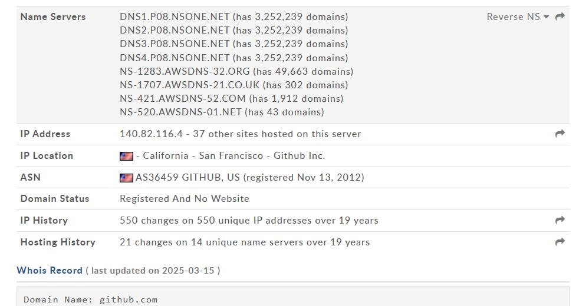
   - DNS-сервера для `google.com` - это NS1.GOOGLE.COM, NS2.GOOGLE.COM, NS3.GOOGLE.COM, NS4.GOOGLE.COM. Ответ получен с помощью `https://ie.godaddy.com/whois`
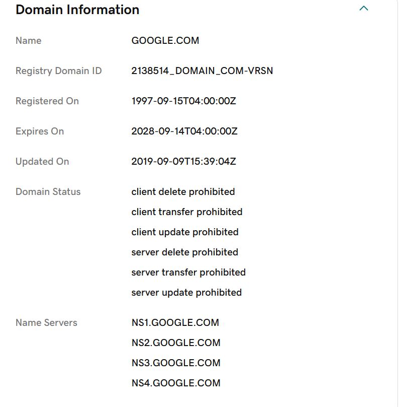
3. Используйте команду nslookup на локальном хосте, чтобы послать запросы трем конкретным
   серверам DNS (по аналогии с Заданием Д): вашему локальному серверу DNS и двум DNS-серверам,
   найденным в предыдущей части.
   - 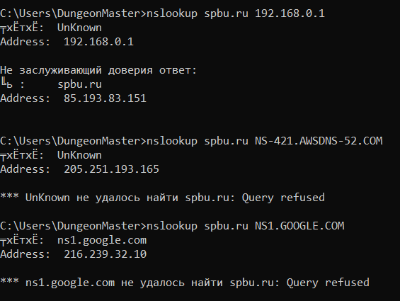
